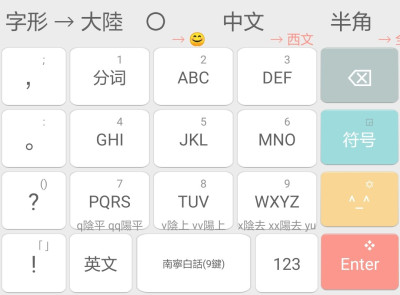
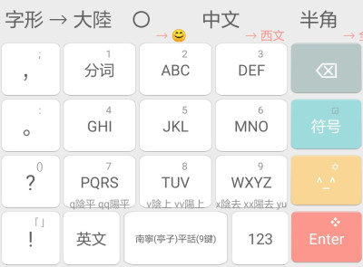

# Rime Nanning Dialect Input Scheme | 南寧話輸入方案

 

> * 採用香港語言學學會粵語拼音方案
> * 提供聲調輸入 q平 v上 x去 （雙擊爲陽調）和多種字形轉換
> * 提供四種反查方案，[`]普拼反查粵拼，[x]五筆畫反查粵拼，[v]倉頡五代反查粵拼，[r][粵語兩分](https://github.com/CanCLID/rime-loengfan)反查粵拼
> * PC上按Ctrl+Enter可將提示音上屏，按Ctrl+Shift+Enter可將候選項上屏

配方： ℞ **leimaau/naamning_jyutping**

[Rime](https://rime.im) 南寧話輸入方案

- 南寧話輸入方案 - `leimaau/naamning_jyutping`
	- 南寧白話 - `naamning_baakwaa`
	- 南寧白話(IPA) - `naamning_baakwaa_ipa`
	- 南寧(亭子)平話 - `naamning_bingwaa`
	- 南寧(亭子)平話(IPA) - `naamning_bingwaa_ipa`
	
## 安卓端

分支[`naamning_jyutping_android`](https://github.com/leimaau/naamning_jyutping/tree/naamning_jyutping_android)中存放配置同文輸入法需要的文件。

若嫌手工配置麻煩，[**此處**](https://github.com/leimaau/naamning_jyutping/releases)已通過 apktool 重新打包，下載安裝即可。

## 拼音方案

[南寧白話拼音方案](https://leimaau.github.io/book/PHONETICIZE.html) | [南寧（亭子）平話拼音方案](https://leimaau.github.io/book/PHONETICIZE_bingwaa.html)

## 使用方法

[本碼表使用技巧](https://leimaau.github.io/book/appendix1/appendix4.2.html)

